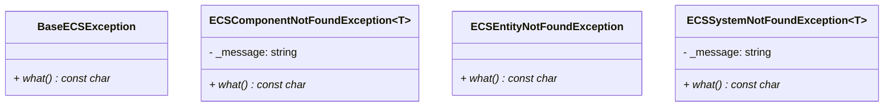

## ECS Error

The **ECSError** file defines a collection of custom exception classes derived from the standard C++ library.  
These exceptions are used throughout the ECS architecture to handle runtime errors safely, such as attempting to access missing components, invalid entities, or non-existent systems.

### Integration

These exceptions are typically thrown by **Safe** getters in the `Entity` and `World` classes.

| Context | Thrown By | Cause |
|:---|:---|:---|
| **Entity** | [`getComponentSafe<T>()`](Entity/Entity.md) | Throws `ECSComponentNotFoundException` if the entity does not have the requested component. |
| **World** | `getSystem<T>()` / Logic | Throws `ECSSystemNotFoundException` if a requested system is not registered. |
| **World** | Entity Management | Throws `ECSEntityNotFoundException` when trying to access an entity ID that has been destroyed or does not exist. |

---

### Exception Classes

| Exception Class | Parent Class | Description |
|:---|:---|:---|
| **BaseECSException** | `std::exception` | The base class for general ECS errors. Returns "Generic ECS Error". |
| **ECSComponentNotFoundException** | `BaseECSException` | **Templated** `<T>`. Thrown when a specific Component type `T` is missing. The error message includes the component's type name. |
| **ECSEntityNotFoundException** | `std::exception` | Thrown when an operation is performed on an invalid or non-existent Entity ID. |
| **ECSSystemNotFoundException** | `std::exception` | **Templated** `<T>`. Thrown when a specific System type `T` is missing from the World. The error message includes the system's type name. |

---

### Internal Structure

