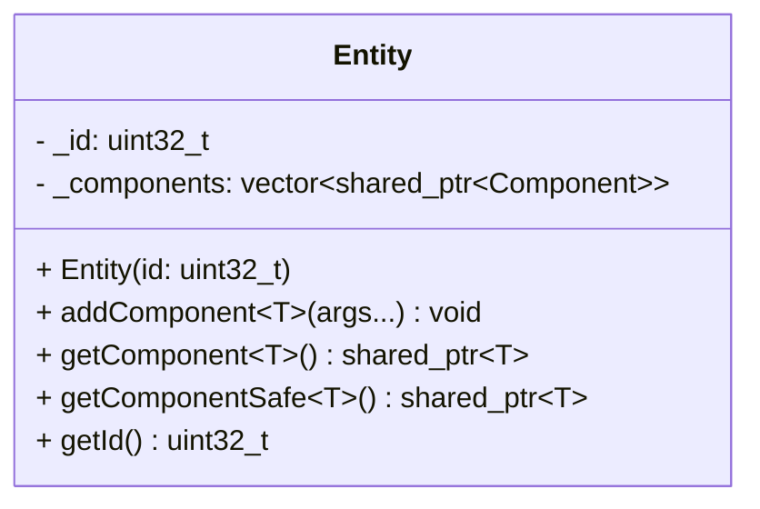

## Entity

The **Entity** class is the fundamental container object in the ECS architecture.  
It represents a distinct object in the game world. An entity is essentially a unique ID paired with a collection of [Components](../component/Component.hpp) that define its data and properties.

### Dependencies & Integration

The Entity is the central node that connects data to logic.

| Type | Name | Description |
|:---|:---|:---|
| **Manager** | [`World`](../World.md) | Entities are created, stored, and destroyed by the **World** class. |
| **Content** | [`Component`](../component/Component.hpp) | An entity holds a dynamic list of components. Without components, an entity is just an empty ID. |
| **System** | *All Systems* | Systems iterate over entities to find those containing specific components to apply logic. |

---

### Public Methods

| Method | Signature | Description |
|:------|:----------|:------------|
| **Add Component** | `template<typename T, typename ... Args> void addComponent(Args&& ... args);` | Creates and attaches a new component of type `T` to the entity. Arguments are forwarded to the component's constructor. |
| **Get Component** | `template<typename T> std::shared_ptr<T> getComponent() const;` | Retrieves a pointer to the requested component type. Returns `nullptr` if the entity does not possess this component. |
| **Get Component (Safe)**| `template<typename T> std::shared_ptr<T> getComponentSafe() const;` | Retrieves a pointer to the requested component. **Throws an exception** (`ECSComponentNotFoundException`) if the component is missing. |
| **Get ID** | `uint32_t getId() const;` | Returns the unique identifier of the entity. |

---

### Constructor

| Constructor | Signature | Description |
|:------------|:----------|:------------|
| **Entity** | `Entity(uint32_t id = 0);` | Constructs a new entity. If `id` is 0 (default), a random unique ID is generated. If `id` is provided, it is assigned explicitly. |

---

### Internal Data

