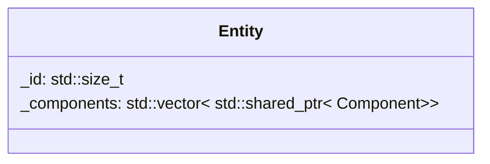

## Entity

| Method | Signature | Description |
| :--- | :--- | :--- |
| **add Component** | `void addComponent(Args&& ... args)` | Add the component to the Entity |
| **get Component** | `std::shared_ptr<T> getComponent(void) const` | return the component given in arguments. 

