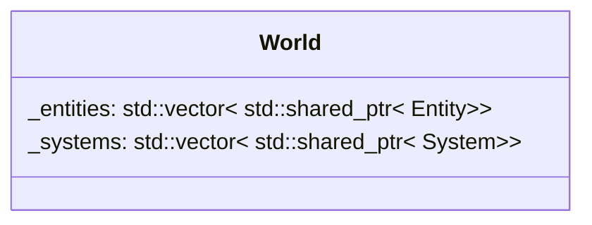

## World

| Method | Signature | Description |
| :--- | :--- | :--- |
| **create Entity** | `std::shared_ptr<Entity> createEntity(void)` | Add an Entity to the world.
| **get all entities with component** | `std::vector<std::shared_ptr<Entity>> getAllEntitiesWithComponent() const` | return all the entities with the component given in parameters.
| **get all entities with components** | `std::vector<std::shared_ptr<Entity>> getAllEntitiesWithComponents() const` | return all the entities with the components given in parameters.
| **add system** | `std::shared_ptr<T> addSystem(Args&&... args)` | add a system to the world. 

