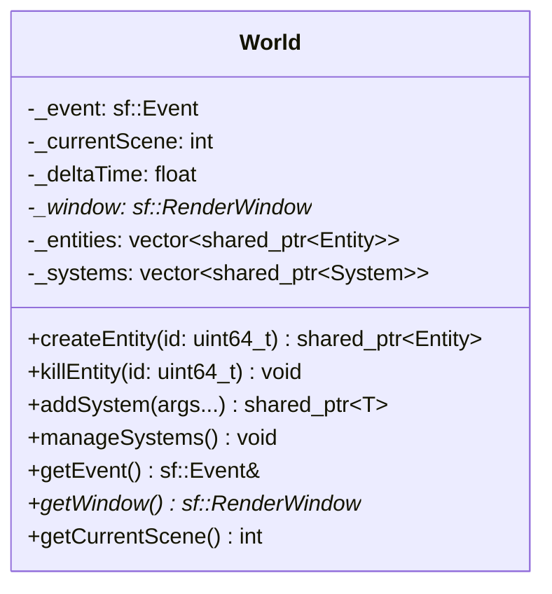

## World

The **World** class is the central manager of the ECS (Entity Component System) architecture.  
It acts as the container for all **Entities** and **Systems**, manages the main game loop execution (`manageSystems`), and holds global states like the Window, Events, Delta Time, and the current Scene.

### Dependencies & Integration

The World is the root object of the game engine.

| Type | Name | Description |
|:---|:---|:---|
| **Manages** | [`Entity`](ECS/Entity/Entity.md) | Creates, stores, and destroys entities. |
| **Manages** | [`System`](ECS/System/System.md) | Stores and executes systems. |
| **Context** | **SFML** | Holds the `sf::RenderWindow` and `sf::Event` used by inputs and rendering systems. |

---

### Public Methods

| Method | Signature | Description |
|:------|:----------|:------------|
| **Create Entity** | `std::shared_ptr<Entity> createEntity(uint64_t id = 0);` | Creates a new entity in the world. If `id` is 0, a random UUID is generated. |
| **Kill Entity** | `void killEntity(uint64_t id);` | Removes an entity from the world by its ID. |
| **Query (Single)** | `std::vector<...> getAllEntitiesWithComponent<T>() const;` | Returns all entities possessing the specific component `T`. |
| **Query (Any)** | `std::vector<...> getEntitiesWithAnyComponent<T...>() const;` | Returns entities possessing **at least one** of the specified components. |
| **Query (All)** | `std::vector<...> getEntitiesWithAllComponents<T...>() const;` | Returns entities possessing **all** of the specified components. |
| **Add System** | `std::shared_ptr<T> addSystem(Args&&... args);` | Creates and registers a new system of type `T`. |
| **Get System** | `std::shared_ptr<T> getSystem() const;` | Retrieves a registered system by its type. |
| **Run Systems** | `void manageSystems();` | Iterates through all registered systems and calls their `update` method. |
| **Get Event** | `sf::Event& getEvent();` | Returns a mutable reference to the current SFML event (used by Input/Mouse systems). |
| **Set Event** | `void setEvent(const sf::Event& event);` | Updates the current global event. |
| **Get Delta Time** | `float getDeltaTime() const;` | Returns the time elapsed since the last frame (in seconds). |
| **Set Delta Time** | `void setDeltaTime(const float& dt);` | Updates the delta time. |
| **Get Window** | `sf::RenderWindow* getWindow() const;` | Returns a pointer to the game window (used by Draw systems). |
| **Set Window** | `void setWindow(sf::RenderWindow& window);` | Sets the reference to the main render window. |
| **Get Scene** | `int getCurrentScene() const;` | Returns the ID of the currently active scene. |
| **Set Scene** | `void setCurrentScene(int scene);` | Changes the active scene ID (used to filter entity rendering/logic). |

---

### Constructor

| Constructor | Signature | Description |
|:------------|:----------|:------------|
| **World** | `World();` | Initializes the world, clearing entities and systems lists, and setting default values for global states. |

---

### Internal Data

