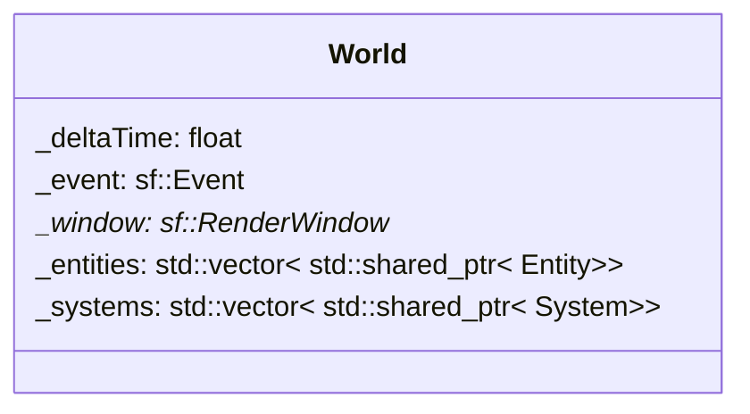

## World

| Method | Signature | Description |
| :--- | :--- | :--- |
| **create Entity** | `std::shared_ptr<Entity> createEntity(void)` | Add an Entity to the world.
| **get all entities with component** | `std::vector<std::shared_ptr<Entity>> getAllEntitiesWithComponent() const` | return all the entities with the component given in parameters.
| **get all entities with components** | `std::vector<std::shared_ptr<Entity>> getAllEntitiesWithComponents() const` | return all the entities with the components given in parameters.
| **add system** | `std::shared_ptr<T> addSystem(Args&&... args)` | add a system to the world. | 
| **manager of systems** | `void manageSystems(void)` | call the update of all the system in world |
| **get event** | `sf::Event& getEvent(void)` | return event variable |
| **set event** | `void setEvent(const sf::Event& event)` | set the pointer of the event given in parameters. |
| **get delta time** | `float getDeltaTime(void) const` | get the delta time. |
| **set delta time** | `void setDeltaTime(const float& dt)` | set the delta time. |
| **get window** | `sf::RenderWindow* getWindow(void)` | get the reference of the window. |
| **set window** | `void setWindow(sf::RenderWindow& window)` | set the reference of the window to the world. |
| **get system** | `template<typename T> / std::shared_ptr<T> getSystem() const` | return the system in the world who have the system class in parameters" |

