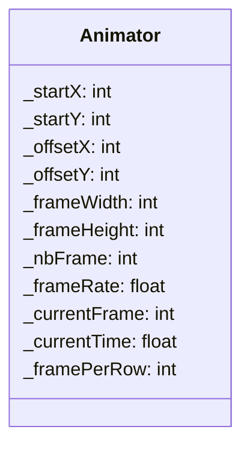

## Animator

The **Animator** component handles sprite animations for entities using a sprite sheet.  
It manages frame switching, animation timing, and texture rectangle computation.

---

### Public Methods

| Method | Signature | Description |
|:------|:----------|:------------|
| **Get current frame** | `int getCurrentFrame() const;` | Returns the current animation frame index. |
| **Get frame rate** | `float getFrameRate() const;` | Returns the time (in seconds) between two frames. |
| **Get current time** | `float getCurrentTime() const;` | Returns the accumulated time since the last frame change. |
| **Get frame rect** | `sf::IntRect getFrameRect() const;` | Returns the texture rectangle of the current frame. |
| **Set frame rate** | `void setFrameRate(float frameRate);` | Updates the animation frame rate. |
| **Set current frame** | `void setCurrentFrame(int currentFrame);` | Forces the current animation frame. |
| **Set current time** | `void setCurrentTime(float currentTime);` | Updates the internal animation timer. |

---

### Constructor

| Constructor | Signature                                                                                                                                             | Description |
|:------------|:------------------------------------------------------------------------------------------------------------------------------------------------------|:------------|
| **Animator** | `Animator(int nbFrame, int framePerRow, float frameRate, int startX, int startY, int frameWidth, int frameHeight, int offsetX = 0, int offsetY = 0);` | Create an animator using a sprite sheet layout. |

---

### Internal Data

