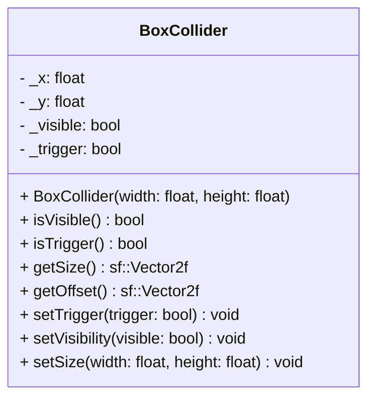

## BoxCollider

The **BoxCollider** component handles collision detection for entities.  
It defines a rectangular area relative to the entity's position, allowing it to interact physically (blocking) or logically (triggering events) with other entities.

### Dependencies & Integration

This component is central to the physics engine and interacts with other components to determine spatial relationships.

| Type | Name | Description |
|:---|:---|:---|
| **System** | [`Collision`](../systems/Collision.md) | The **Collision** system iterates over entities with BoxColliders to detect overlaps and resolve logic.

---

### Public Methods

| Method | Signature | Description |
|:------|:----------|:------------|
| **Get visibility** | `bool isVisible() const;` | Returns `true` if the debug outline of the collider should be drawn. |
| **Get trigger state** | `bool isTrigger() const;` | Returns `true` if the collider is a trigger (non-solid), `false` if it is a physical obstacle. |
| **Get size** | `sf::Vector2f getSize() const;` | Returns the width and height of the collision box. |
| **Get offset** | `sf::Vector2f getOffset() const;` | Returns the relative offset (x, y) from the entity's origin. |
| **Set trigger** | `void setTrigger(bool trigger);` | Sets the collider as a trigger (pass-through) or solid. |
| **Set visibility** | `void setVisibility(bool visible);` | Enables or disables the rendering of the debug outline. |
| **Set size** | `void setSize(float width, float height);` | Updates the dimensions of the collision box. |

---

### Constructor

| Constructor | Signature | Description |
|:------------|:----------|:------------|
| **BoxCollider** | `explicit BoxCollider(float width, float height);` | Creates a collider with the specified dimensions. Default visibility and trigger are `false`. |

---

### Internal Data

