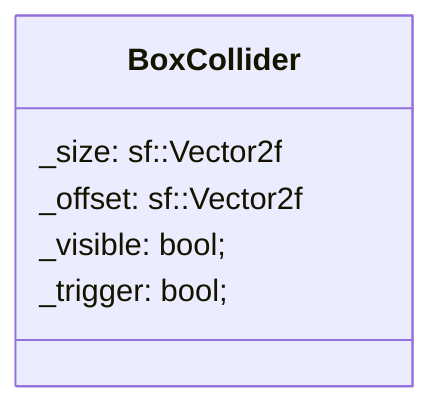

## BoxCollider

The BoxCollider component hold the display priority of the entity.

| Method                    | Signature                                    | Description                                                 |
|:--------------------------|:---------------------------------------------|:------------------------------------------------------------|
| **Get the visibility**    | `bool isVisible() const;`                    | Returns the visibility of the box collider.                 |
| **Get if trigger**        | `bool isTrigger() const`                     | Returns a value if an object is in the trigger area or not. |
| **Get the size**          | `sf::Vector2f getSize() const`               | Returns the size of the box collider.                       |
| **Get the offset**        | `sf::Vector2f getOffset() const`             | Returns the offset of the box collider.                     |
| **set the trigger value** | `void setTrigger(bool trigger)`              | Updates the trigger value.                                  |
| **set the visible value** | `void setVisibility(bool visible)`           | Updates the visible value.                                  |
| **set the size vector**   | `void setSize(const sf::Vector2f &size)`     | Updates the size vector.                                    |
| **set the offset vector** | `void setOffset(const sf::Vector2f &offset)` | Updates the offset vector.                                  |

