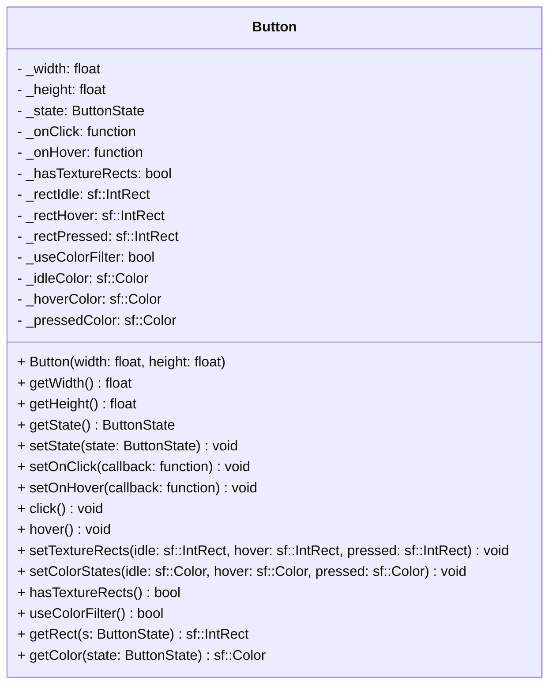

## Button

The **Button** component transforms an entity into an interactive UI element.  
It manages interaction states (Idle, Hover, Pressed) and executes specific callbacks when interaction events occur. It can also manage visual changes (TextureRect or Color) based on these states.

### Dependencies & Integration

This component relies on input systems to detect interactions and often modifies visual components.

| Type | Name | Description |
|:---|:---|:---|
| **System** | [`Mouse`](../systems/Mouse.md) | The **Mouse** system checks for intersections between the cursor and the button's area (defined by `Position` and button size) to update the state. |
---

### Public Methods

| Method | Signature | Description |
|:------|:----------|:------------|
| **Get dimensions** | `float getWidth() const;` `float getHeight() const;` | Returns the width and height of the button's hit-box. |
| **Get state** | `ButtonState getState() const;` | Returns the current state (`IDLE`, `HOVER`, `PRESSED`). |
| **Set state** | `void setState(ButtonState state);` | Manually updates the current state of the button. |
| **Set callbacks** | `void setOnClick(std::function<void()> callback);` `void setOnHover(std::function<void()> callback);` | Assigns the functions to execute when the button is clicked or hovered. |
| **Trigger actions**| `void click();` `void hover();` | Executes the assigned callbacks immediately. |
| **Set texture rects**| `void setTextureRects(const sf::IntRect& idle, const sf::IntRect& hover, const sf::IntRect& pressed);` | Defines the texture areas to display for each state (useful for sprite sheets). |
| **Set color states** | `void setColorStates(const sf::Color& idle, const sf::Color& hover, const sf::Color& pressed);` | Defines color filters to apply for each state. |
| **Visual helpers** | `bool hasTextureRects() const;` `bool useColorFilter() const;` | Checks if specific visual modes are enabled. |
| **Get visual data** | `const sf::IntRect& getRect(ButtonState s) const;` `sf::Color getColor(ButtonState state) const;` | Retrieves the specific rectangle or color associated with a state. |

---

### Constructor

| Constructor | Signature | Description |
|:------------|:----------|:------------|
| **Button** | `Button(float width, float height);` | Creates a button with defined dimensions. Default state is `IDLE`. |

---

### Internal Data

