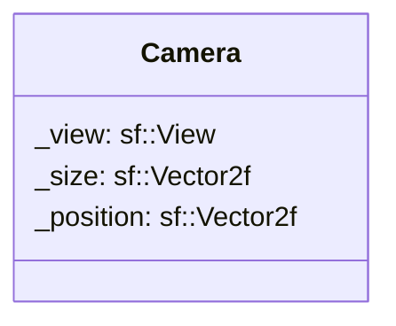

## Camera

The Camera component hold the camera / view of the game (for not only one can be here)

| Method                    | Signature                                    | Description                                                 |
|:--------------------------|:---------------------------------------------|:------------------------------------------------------------|
| **Get size**      | `sf::Vector2f getSize() const;`                   | Returns the size of the view.                 |
| **Get position**  | `sf::Vector2f getPosition() const`                | Returns the position of the view. |
| **Get view**      | `sf::View& getView()`                             | Returns the view as reference.                       |
| **set size**      | `void setSize(const sf::Vector2f &size)`          | Updates the size fo the view.                                  |
| **set position**  | `void setPosition(const sf::Vector2f &position)`  | Updates the position of the view.                                  |
| **set view**      | `void setView(const sf::View& view)`              | Updates the view.                                    |

