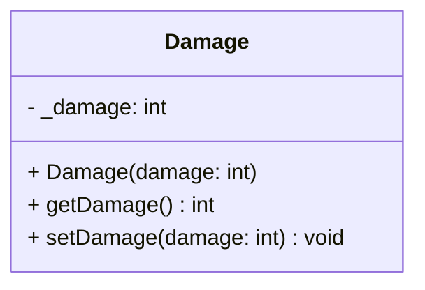

## Damage

The **Damage** component defines the offensive capability of an entity.  
It specifies the amount of health points to be deducted from a target entity upon impact or interaction.

### Public Methods

| Method | Signature | Description |
|:------|:----------|:------------|
| **Get damage** | `int getDamage() const;` | Returns the amount of damage this entity deals. |
| **Set damage** | `void setDamage(const int damage);` | Updates the damage value. |

---

### Constructor

| Constructor | Signature | Description |
|:------------|:----------|:------------|
| **Damage** | `explicit Damage(int damage);` | Initializes the component with a specific damage value. |

---

### Internal Data

