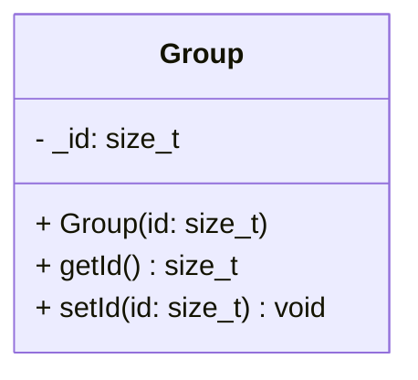

## Group

The **Group** component assigns a numerical identifier to an entity to associate it with a specific logical collection.  
This is useful for managing squads of enemies, waves, multi-part entities (like a boss with separate turrets), or teams.

### Dependencies & Integration

This component is primarily used by high-level game logic or AI systems to process entities in batches.

| Type | Name | Description |
|:---|:---|:---|
| **System** | *Game Logic* | Custom game systems can query entities with a specific **Group** ID to apply collective behaviors or to search a specific entity. |

---

### Public Methods

| Method | Signature | Description |
|:------|:----------|:------------|
| **Get ID** | `size_t getId() const;` | Returns the unique group identifier. |
| **Set ID** | `void setId(size_t id);` | Updates the group identifier. |

---

### Constructor

| Constructor | Signature | Description |
|:------------|:----------|:------------|
| **Group** | `explicit Group(size_t id);` | Initializes the component with a specific group ID. |

---

### Internal Data

