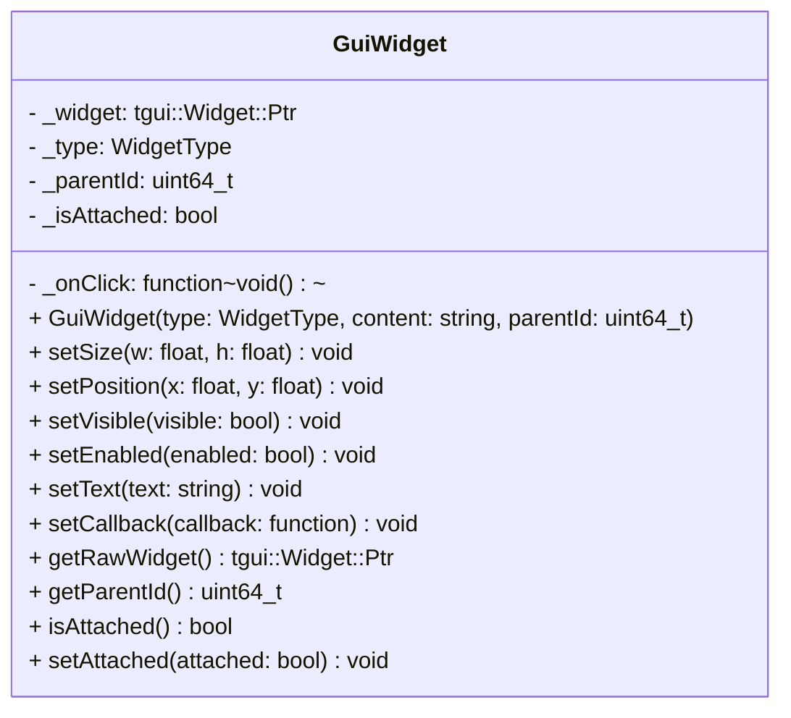

## GuiWidget

The **GuiWidget** component acts as an abstraction layer between the ECS and the **TGUI** library. It allows UI elements (Buttons, Labels, EditBoxes, etc.) to be managed as standard entities, supporting hierarchical nesting (Parent/Child), scene filtering, and standard ECS positioning.

### Dependencies & Integration

This component bridges the gap between hardware events, game logic, and UI rendering.

| Type | Name | Description |
|:---|:---|:---|
| **System** | [`GuiSystem`](../systems/GuiSystem.md) | The **GuiSystem** is the sole manager of this component. It handles event propagation, hierarchical attachment, scene visibility, and sorting by **Layer**. |
| **Component** | [`Position`](Position.md) | If present, the **GuiSystem** synchronizes this value with the widget's absolute position on screen. |
| **Component** | [`Scene`](Scene.md) | Used to show/hide and enable/disable widgets based on the current active scene. |
| **Component** | [`Layer`](Layer.md) | Determines the rendering order (Z-index). Widgets with higher layers are moved to the front. |

---

### Public Methods

#### General Configuration
| Method | Signature | Description |
|:------|:----------|:------------|
| **Set Size** | `void setSize(float w, float h);` | Sets the width and height of the widget. |
| **Set Position** | `void setPosition(float x, float y);` | Sets the absolute coordinates (pixels). |
| **Set Position (Rel)**| `void setPosition(const string& x, const string& y);` | Sets relative positions (e.g., `"50%"`, `"center"`). |
| **Set Origin** | `void setOrigin(float x, float y);` | Sets the pivot point (e.g., `0.5, 0.5` for center). |
| **Visibility/State** | `void setVisible(bool v);` `void setEnabled(bool e);` | Controls if the widget is drawn and if it accepts inputs. |
| **Focus** | `void setFocus();` | Forces the widget to gain keyboard/mouse focus. |

#### Text & Styling
| Method | Signature | Description |
|:------|:----------|:------------|
| **Set Font** | `void setFont(const string& path);` | Loads and applies a `.ttf` or `.otf` font file. |
| **Set Text** | `void setText(const string& text);` | Sets the string content (Label, Button, EditBox, etc.). |
| **Set Text Size** | `void setTextSize(uint size);` | Sets the character size in pixels. |
| **Set Text Color** | `void setTextColor(sf::Color color);` | Sets the color of the displayed text. |
| **Set Text Style** | `void setTextStyle(tgui::TextStyle style);` | Applies styles like Bold or Italic. |
| **Set Alignment** | `void setTextAlignment(tgui::HorizontalAlignment a);` | Sets text horizontal alignment (Left, Center, Right). |

#### Specific Widget Logic
| Method | Signature | Description |
|:------|:----------|:------------|
| **Set Callback** | `void setCallback(function<void()> func);` | Sets the function to execute when a button is pressed. |
| **EditBox Config** | `void setPlaceholder(const string& p);` `void setPasswordMode(bool m);` | Sets the ghost text or masks input with `*`. |
| **Input Validation**| `void setInputValidator(const string& regex);` | Restricts EditBox input using a regex pattern. |
| **Value Control** | `void setValue(float val);` `void setRange(float min, float max);` | Configures Slider values. |
| **Checkbox Logic** | `void setChecked(bool checked);` | Manually toggles a CheckBox state. |

---

### Constructor

| Constructor | Signature | Description |
|:------------|:----------|:------------|
| **GuiWidget** | `GuiWidget(WidgetType type, const std::string& content = "", uint64_t parentId = 0);` | Creates a specific TGUI widget type. If `parentId` is provided, the system will attempt to attach this widget to the parent entity's container. |

---

### Internal Data

