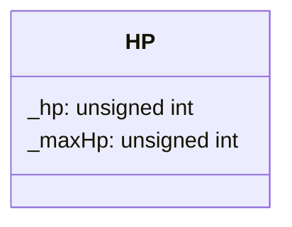

## HP

The HP component holds the HP (Health point)

| Method | Signature | Description |
| :--- | :--- | :--- |
| **Get HP** | `unsigned int getHP() const;` | Returns the current HP. |
| **Get MaxHP** | `unsigned int getMaxHP() const;` | Returns the current Max Hp. |
| **Set HP** | `void setHP(unsigned int maxHp);` | Updates the HP. |
| **Set MaxHP** | `void setMaxHP(unsigned int maxHp);` | Updates the MaxHP. |

