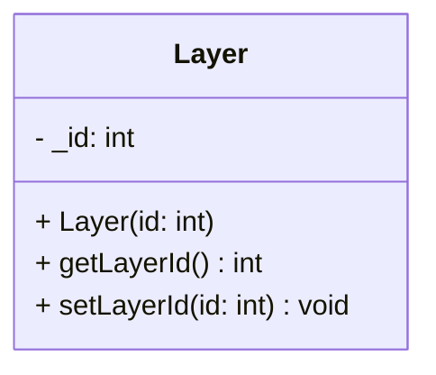

## Layer

The **Layer** component defines the rendering order (Z-index) of an entity.  
It assigns an integer priority to the entity, allowing the rendering system to determine which objects should appear in the background (lower values) and which should appear in the foreground (higher values).

### Dependencies & Integration

This component is critical for the visual composition of the scene.

| Type | Name | Description |
|:---|:---|:---|
| **System** | [`Draw`](../systems/Draw.md) | The **Draw** system retrieves all entities with a Sprite, sorts them based on their **Layer** ID, and renders them in ascending order (Painter's Algorithm). |
| **Enum** | `LayerType` | (Optional) Often used with an enum (e.g., `BACKGROUND = -1`, `UI = 1000`) to maintain consistent layering constants. |

---

### Public Methods

| Method | Signature | Description |
|:------|:----------|:------------|
| **Get Layer ID** | `int getLayerId() const;` | Returns the current rendering priority. |
| **Set Layer ID** | `void setLayerId(int id);` | Updates the rendering priority. |

---

### Constructor

| Constructor | Signature | Description |
|:------------|:----------|:------------|
| **Layer** | `explicit Layer(int id);` | Initializes the component with a specific layer priority. |

---

### Internal Data

