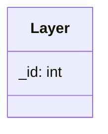

## Layer

The Layer component hold the display priority of the entity.

| Method | Signature | Description |
| :--- | :--- | :--- |
| **Get Layer Id** | `int getLayerId() const` | Returns the current Layer Id. |
| **Set Layer Id** | `void setLayerId(const int id)` | Update the current Id by the new one. |

