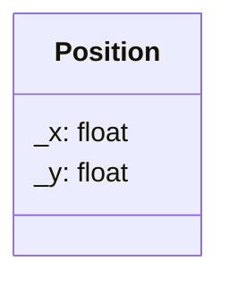

## Position

The Position component is one of the fundamental data structures in our ECS. It holds the 2D coordinates of an entity within the game world.

| Method | Signature | Description |
| :--- | :--- | :--- |
| **Get X** | `float getX()` | Returns the current horizontal position. |
| **Get Y** | `float getY()` | Returns the current vertical position. |
| **Set X** | `void setX(float x)` | Updates the horizontal position. |
| **Set Y** | `void setY(float y)` | Updates the vertical position. |

