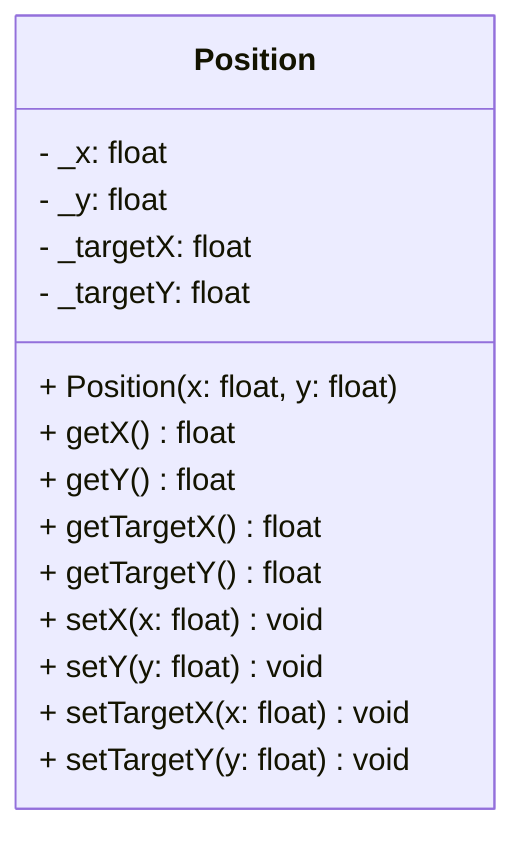

## Position

The **Position** component is the fundamental spatial data structure in the ECS.  
It holds the current 2D coordinates (X, Y) of an entity. It also stores **Target** coordinates (`_targetX`, `_targetY`), which are often used for smooth interpolation, server reconciliation, or pathfinding destinations.

### Dependencies & Integration

This component is the most heavily used component, acted upon by nearly every system.

| Type | Name | Description |
|:---|:---|:---|
| **System** | [`Draw`](../systems/Draw.md) | The **Draw** system reads the current X/Y to determine where to render the entity on the screen. |
| **System** | [`Movement`](../systems/Movement.md) | The **Movement** system updates the current position. It may also use target coordinates to interpolate movement smoothly over time. |
| **System** | [`CameraSys`](../systems/CameraSys.md) | The **CameraSys** system uses the current position of the camera entity to determine the viewport's center. |
| **System** | [`Mouse`](../systems/Mouse.md) | The **Mouse** system uses the entity's **Position** to calculate its absolute screen bounds for detecting clicks and hover events (e.g., on Buttons). |
| **System** | [`TextSys`](../systems/TextSys.md) | The **TextSys** system reads the **Position** to determine where to render text elements on the screen. |
---

### Public Methods

| Method | Signature | Description |
|:------|:----------|:------------|
| **Get X** | `float getX() const;` | Returns the current horizontal position. |
| **Get Y** | `float getY() const;` | Returns the current vertical position. |
| **Get Target X** | `float getTargetX() const;` | Returns the target horizontal position (destination). |
| **Get Target Y** | `float getTargetY() const;` | Returns the target vertical position (destination). |
| **Set X** | `void setX(float x);` | Updates the current horizontal position. |
| **Set Y** | `void setY(float y);` | Updates the current vertical position. |
| **Set Target X** | `void setTargetX(float x);` | Updates the target horizontal position. |
| **Set Target Y** | `void setTargetY(float y);` | Updates the target vertical position. |

---

### Constructor

| Constructor | Signature | Description |
|:------------|:----------|:------------|
| **Position** | `Position(float x, float y);` | Initializes the component with specific coordinates. Target coordinates are usually initialized to these same values. |

---

### Internal Data

