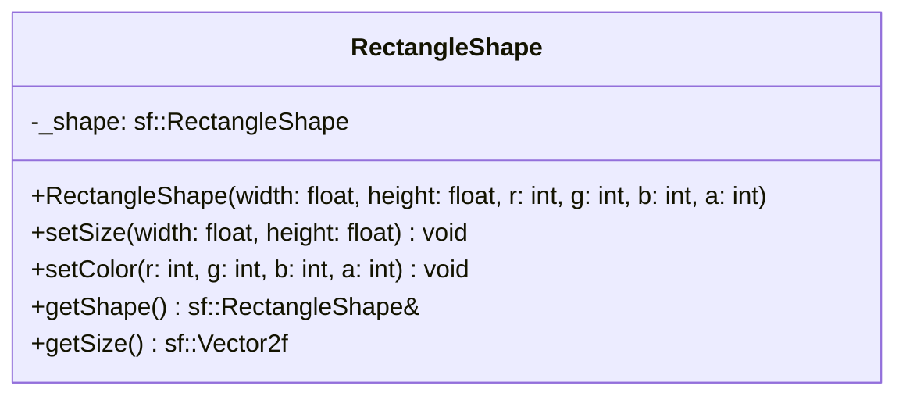

## RectangleShape

The **RectangleShape** component allows entities to be rendered as simple geometric rectangles without requiring an external texture file.  
It is useful for prototyping, creating simple UI backgrounds, health bars, or debug visuals.

### Dependencies & Integration

This component is a visual element and requires the rendering pipeline to be visible.

| Type | Name | Description |
|:---|:---|:---|
| **System** | [`Draw`](../systems/Draw.md) | The **Draw** system retrieves the internal SFML shape, applies the entity's [`Position`](Position.md), and renders it to the window and optionaly the [`Scale`](Scale.md), [`Rotation`](Rotation.md) component. |
| **Linked Component** | [`Position`](Position.md) | Required to determine where the rectangle is drawn on the screen. |
| **Linked Component** | [`Layer`](Layer.md) | (Optional) Determines the rendering order relative to sprites and other shapes. |

---

### Public Methods

| Method | Signature | Description |
|:------|:----------|:------------|
| **Get Shape** | `sf::RectangleShape& getShape();` | Returns a mutable reference to the internal SFML shape object (allows advanced SFML modifications). |
| **Get Size** | `sf::Vector2f getSize() const;` | Returns the current width and height of the rectangle. |
| **Set Size** | `void setSize(float width, float height);` | Updates the dimensions of the rectangle. |
| **Set Color** | `void setColor(int red, int green, int blue, int alpha);` | Updates the fill color using RGBA values (0-255). |

---

### Constructor

| Constructor | Signature | Description |
|:------------|:----------|:------------|
| **RectangleShape** | `RectangleShape(float width, float height, int r = 255, int g = 255, int b = 255, int a = 255);` | Initializes the rectangle with specific dimensions and an optional color (default is White). |

---

### Internal Data

