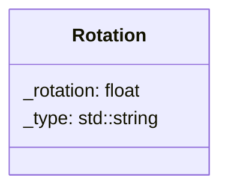

## Rotation

The Rotation component that can contain the rotation value of the sprite or the box collider component created with the component linked to it and by default the value 0.0f.

| Method | Signature | Description |
| :--- | :--- | :--- |
| **Rotation**     | `Rotation(float rotation = 0.0f, template<typename T>)` | create the rotation component with the value 0.0 by default and the component linked to it (Sprite / Box collider). 
| **Get Rotation** | `float getRotation() const` | Returns the value of the rotation. |
| **Set Rotation** | `void setRotation(float rotation)` | Update the current rotation.

