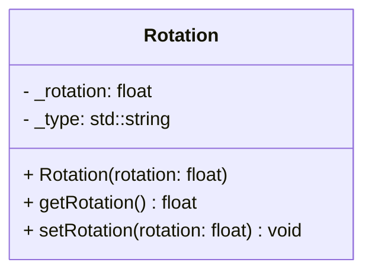

## Rotation

The **Rotation** component defines the orientation of an entity in 2D space.  
It stores an angle in degrees, which is applied to the entity's visual representation (Sprite, RectangleShape, Text) or potentially its physical bounds.

### Dependencies & Integration

This component is read by rendering and physics systems to transform the entity.

| Type | Name | Description |
|:---|:---|:---|
| **System** | [`Draw`](../systems/Draw.md) | The **Draw** system applies the rotation angle to the `sf::Sprite` (via `setRotation`) before rendering it to the window. |
| **System** | [`TextSys`](../systems/TextSys.md) | The **TextSys** system reads the **Rotation** to determine the rotation of the entity who have to be displayed on screen. |

---

### Public Methods

| Method | Signature | Description |
|:------|:----------|:------------|
| **Get Rotation** | `float getRotation() const;` | Returns the current rotation angle in degrees. |
| **Set Rotation** | `void setRotation(float rotation);` | Updates the rotation angle. |

---

### Constructor

| Constructor | Signature | Description |
|:------------|:----------|:------------|
| **Rotation** | `Rotation(float rotation = 0.0f);` | Initializes the component with a specific angle (default is 0 degrees). |

---

### Internal Data

