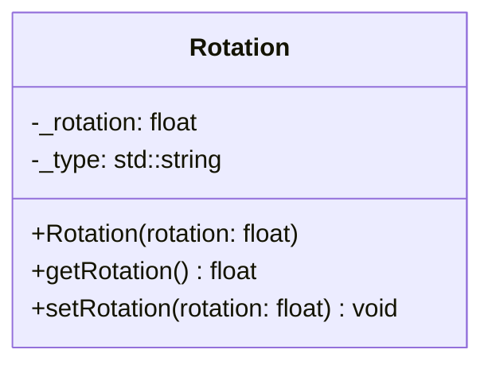

## Rotation 

The Rotation component defines the rotation angle of an entity in degrees. It is used by systems to orient visual elements (Sprites) or physical elements (BoxColliders) associated with the entity.

| Method | Signature | Description |
|:---|:---|:---|
| **Constructor** | `Rotation(float rotation = 0.0f)` | Initializes the component with a specific angle in degrees (default is 0.0f). |
| **Get Rotation** | `float getRotation() const` | Returns the current rotation value in degrees. |
| **Set Rotation** | `void setRotation(float rotation)` | Updates the rotation angle. |

