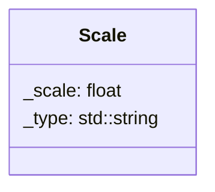

## Scale

The Scale component can modify the component linked to it

| Method | Signature | Description |
| :--- | :--- | :--- |
| :--- | :--- | :--- |
| **Scale**     | `Scale(float scale = 1.0f, template<typename T>)` | create the scale component with the value 1.0f by default and the component linked to it (Sprite / Box collider). 
| **Get Scale** | `float getScale() const` | Returns the current scale. |
| **Set Scale** | `void setScale(float scale)` | Update the scale. |

