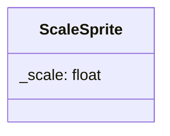

## Scale Sprite

The Scale component can modify the sprite

| Method | Signature | Description |
| :--- | :--- | :--- |
| **Get Scale** | `float getScale() const` | Returns the current scale of the sprite. |
| **Set Scale** | `void setScale(float scale)` | Update the scale of the sprite. |

