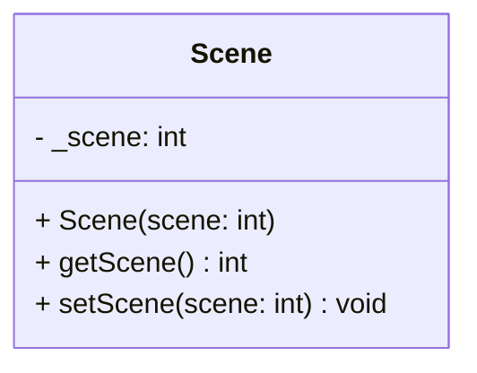

## Scene

The **Scene** component assigns an entity to a specific logical game state or "screen" (e.g., Main Menu, Gameplay, Game Over).  
Systems use this component to filter entities: an entity is usually only updated or rendered if its assigned **Scene** ID matches the current active scene in the `World`. The Entity **Must** have the `Scene` component to be displayed

### Dependencies & Integration

This component acts as a high-level filter for all systems.

| Type | Name | Description |
|:---|:---|:---|
| **System** | *All Systems* | Most systems (like [`Draw`](../systems/Draw.md), [`Movement`](../systems/Movement.md)) check this component to ignore entities that belong to inactive scenes. |
| **Context** | `World` | The `World` class holds the "Current Scene" ID, against which this component is compared. |

---

### Public Methods

| Method | Signature | Description |
|:------|:----------|:------------|
| **Get Scene ID** | `int getScene() const;` | Returns the ID of the scene this entity belongs to. |
| **Set Scene ID** | `void setScene(int scene);` | Updates the scene ID, effectively moving the entity to a different game state. |

---

### Constructor

| Constructor | Signature | Description |
|:------------|:----------|:------------|
| **Scene** | `explicit Scene(int scene = 1);` | Initializes the component with a specific scene ID (default is 1). |

---

### Internal Data

