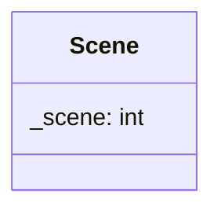

## Scene

The Scene component is linked to the entity and is the scne of displaying by world.

| Method | Signature | Description |
| :--- | :--- | :--- |
| **Scene**     | `Scene(int scene = 1>)` | create the Scene component with the value 1 by default. 
| **Get Scene** | `int getScene() const` | Returns the current Scene. |
| **Set Scene** | `void setScene(int scene)` | Update the Scene. |

