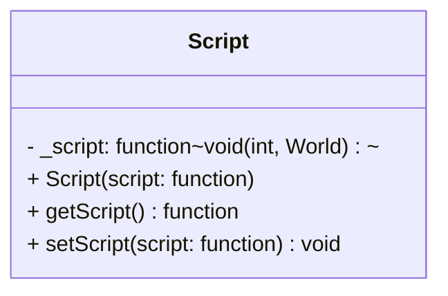

## Script

The **Script** component is a flexible container that allows attaching custom logic to an entity.  
Instead of creating a new Component/System pair for every unique behavior, this component stores a `std::function` (lambda or function pointer) that can be executed by the logic system. This is perfect for one-off behaviors like "Player Input", "AI Logic".

### Dependencies & Integration

This component is the entry point for custom game logic.

| Type | Name | Description |
|:---|:---|:---|
| **System** | [`ScriptsSys`](../systems/ScriptsSys.md) | The **ScriptsSys** system iterates over all entities with a **Script** component and executes the stored function, passing the `EntityID` and `World` context. |

---

### Public Methods

| Method | Signature | Description |
|:------|:----------|:------------|
| **Get Script** | `std::function<void(int, World&)> getScript() const;` | Returns the stored function object to be executed. |
| **Set Script** | `void setScript(std::function<void(int, World&)> script);` | Updates or replaces the logic function assigned to this entity. |

---

### Constructor

| Constructor | Signature | Description |
|:------------|:----------|:------------|
| **Script** | `explicit Script(std::function<void(int, World&)> script = nullptr);` | Initializes the component with a specific logic function. Defaults to `nullptr` if not provided. |

---

### Internal Data

