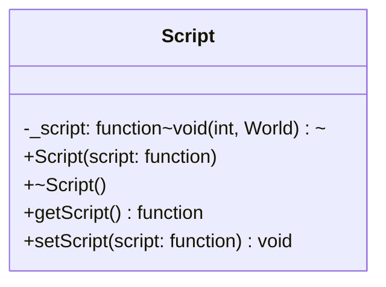

## Script

The **Script** component is a flexible container that allows attaching custom logic (behavior) to an entity. Instead of creating a new class for every behavior, this component stores a `std::function` that can be executed by a system (typically a `ScriptSystem`), providing the script with the Entity's ID and the World context.

| Method | Signature | Description |
|:---|:---|:---|
| **Constructor** | `Script(std::function<void(int, World&)> script)` | Initializes the component with a specific logic function. Defaults to `nullptr` if not provided. |
| **Destructor** | `~Script()` | Default destructor. |
| **Get Script** | `getScript() const` | Returns the stored function object to be executed. |
| **Set Script** | `setScript(std::function<void(int, World&)> script)` | Updates or replaces the logic function assigned to this entity. |

