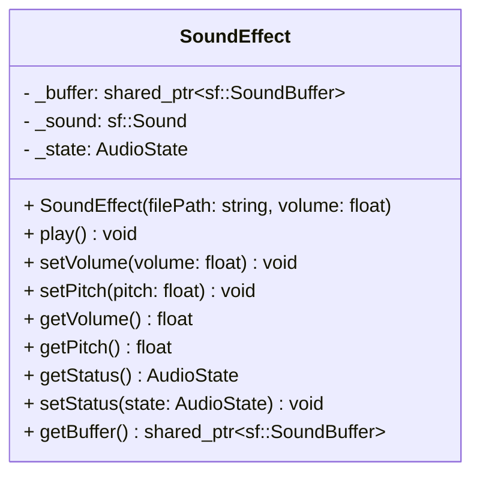

## SoundEffect

The **SoundEffect** component is designed for short, repetitive audio clips (e.g., gunshots, explosions, UI clicks). It stores the audio data in a shared buffer to optimize memory and uses an internal state that allows the `Audio` system to trigger polyphonic playback (overlapping sounds).

### Dependencies & Integration

This component stores data and requests playback, while the system handles the actual SFML sound instances to allow multiple sounds to play simultaneously.

| Type | Name | Description |
|:---|:---|:---|
| **System** | [`AudioSys`](../systems/AudioSys.md) | Reads the component's state and spawns independent sound instances to achieve polyphony. |

---

### Public Methods

| Method | Signature | Description |
|:------|:----------|:------------|
| **Play** | `void play();` | Sets the component state to `PLAYING`, signaling the system to trigger the sound. |
| **Get Status** | `AudioState getStatus() const;` | Returns the current logic state (`PLAYING` or `STOPPED`). |
| **Set Status** | `void setStatus(AudioState state);` | Updates the logic state (used by the system to reset after triggering). |
| **Set Volume** | `void setVolume(float volume);` | Sets the volume for the sound effect (0 to 100). |
| **Set Pitch** | `void setPitch(float pitch);` | Adjusts the speed/pitch of the sound (default is 1.0). |
| **Get Volume** | `float getVolume() const;` | Returns the current volume level. |
| **Get Pitch** | `float getPitch() const;` | Returns the current pitch level. |
| **Get Buffer** | `std::shared_ptr<sf::SoundBuffer> getBuffer() const;` | Returns the shared audio buffer used for playback. |

---

### Constructor

| Constructor | Signature | Description |
|:------------|:----------|:------------|
| **SoundEffect** | `SoundEffect(const std::string& filePath, float volume = 100.0f);` | Loads the audio file into a shared buffer and initializes the volume. |

---

### Internal Data

