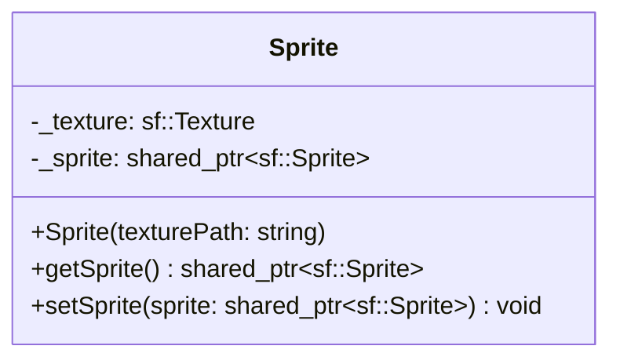

## Sprite

The **Sprite** component handles the visual representation of an entity.  
It loads and stores the texture (image) and the SFML Sprite object, acting as the bridge between the ECS logic and the SFML rendering engine.

### Dependencies & Integration

This is the primary component for visual output.

| Type | Name | Description |
|:---|:---|:---|
| **System** | [`Draw`](../systems/Draw.md) | The **Draw** system retrieves the **Sprite** to render it onto the window. |
| **System** | [`Animation`](../systems/Animation.md) | The **Animation** system modifies the **Sprite**'s texture rectangle (`setTextureRect`) to animate it. |
| **Linked Component** | [`Position`](Position.md) | The position of the **Sprite** is updated based on the **Position** component before drawing. |

---

### Public Methods

| Method | Signature | Description |
|:------|:----------|:------------|
| **Get Sprite** | `std::shared_ptr<sf::Sprite> getSprite() const;` | Returns a pointer to the internal SFML sprite object (used for drawing or modification). |
| **Set Sprite** | `void setSprite(const std::shared_ptr<sf::Sprite>& sprite);` | Replaces the current sprite with a new one. |

---

### Constructor

| Constructor | Signature | Description |
|:------------|:----------|:------------|
| **Sprite** | `explicit Sprite(const std::string& texturePath);` | Initializes the component by loading a texture from the specified file path. |

---

### Internal Data

