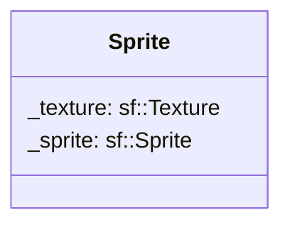

## Sprite

The Sprite component contains the 

| Method | Signature | Description |
| :--- | :--- | :--- |
| **Get Sprite** | `std::shared<sf::Sprite> getSprite() const` | Returns the current sprite of the entity. |
| **Set Sprite** | `void setSprite(const std::shared_ptr<sf::Sprite>& sprite)` | Update the current sprite.

