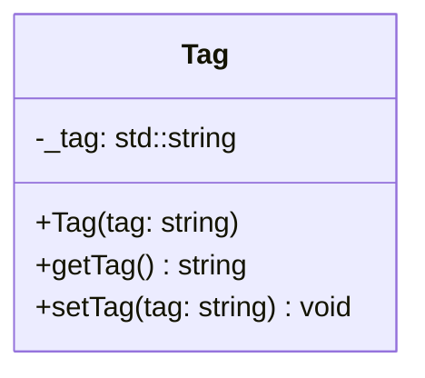

## Tag

The **Tag** component provides a string-based identifier for an entity.  
It allows systems and game logic to locate specific entities without relying on dynamic numerical IDs.

### Dependencies & Integration

This component is primarily used for querying and logic filtering.

| Type | Name | Description |
|:---|:---|:---|
| **Helper** | [`GameHelper`](../../Game/GameHelper.md) | The **GameHelper** uses tags to retrieve specific unique entities (like `GameHelper::getEntityByTag`). |

---

### Public Methods

| Method | Signature | Description |
|:------|:----------|:------------|
| **Get Tag** | `std::string getTag() const;` | Returns the string identifier of the entity. |
| **Set Tag** | `void setTag(const std::string &tag);` | Updates the string identifier. |

---

### Constructor

| Constructor | Signature | Description |
|:------------|:----------|:------------|
| **Tag** | `explicit Tag(const std::string &tag);` | Initializes the component with a specific name. |

---

### Internal Data

