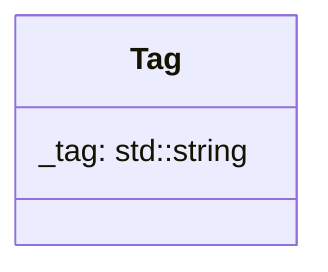

## Tag

The Tag component contains the

| Method           | Signature                       | Description                         |
|:-----------------|:--------------------------------|:------------------------------------|
| **Get tag name** | `std::string getTag() const`    | Returns the tag name of the entity. |
| **Set tag name** | `void setTag(std::string &tag)` | Update the current tag name.        

