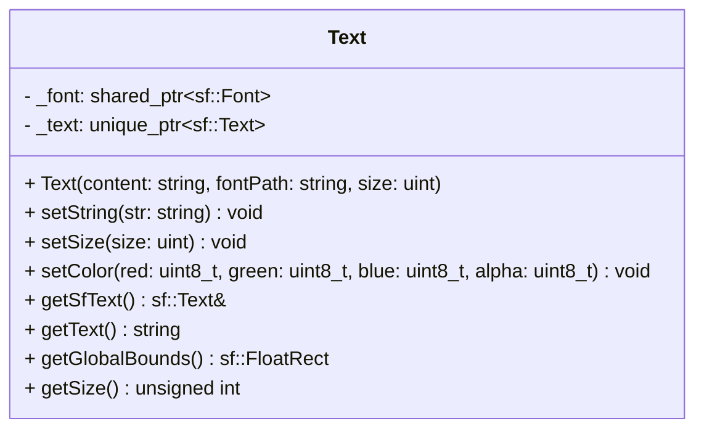

## Text

The **Text** component handles the rendering of string characters on the screen.  
It manages the loading of the font file and stores the SFML text object. It is used for UI elements, labels, scores, or in-game messages.

### Dependencies & Integration

This component requires a specific system to be rendered and interacts with spatial components.

| Type | Name | Description |
|:---|:---|:---|
| **System** | [`TextSys`](../systems/TextSys.md) | The **TextSys** system retrieves the **Text** component, applies the entity's [`Position`](Position.md), and draws it to the window. |
| **Linked Component** | [`Position`](Position.md) | Required to determine where the text starts drawing (top-left corner usually). |
| **Linked Component** | [`Layer`](Layer.md) | (Optional) Used to sort text against sprites and backgrounds. |

---

### Public Methods

| Method            | Signature                                                                       | Description                                                                                |
|:------------------|:--------------------------------------------------------------------------------|:-------------------------------------------------------------------------------------------|
| **Set String**    | `void setString(const std::string& str);`                                       | Updates the text content to be displayed.                                                  |
| **Set Size**      | `void setSize(unsigned int size);`                                              | Updates the character size (in pixels).                                                    |
| **Set Color**     | `void setColor(uint8_t red, uint8_t green, uint8_t blue, uint8_t alpha = 255);` | Updates the text fill color.                                                               |
| **Get SFML Text** | `sf::Text& getSfText();`                                                        | Returns a mutable reference to the internal SFML text object (for advanced modifications). |
| **Get Content**   | `std::string getText();`                                                        | Returns the current string content.                                                        |
| **Get Bounds**    | `sf::FloatRect getGlobalBounds() const;`                                        | Returns the bounding box of the text (useful for alignment or collision).                  |
| **Get Size**      | `unsigned int getSize() const;`                                                 | Returns the Size of the text                                                               |
| **Get Font Path** | `std::string getFontPath() const;`                                              | Returns the Font Path of the text                                                          |

---

### Constructor

| Constructor | Signature | Description |
|:------------|:----------|:------------|
| **Text** | `Text(const std::string& content, const std::string& fontPath, unsigned int size = 20);` | Initializes the text with content, loads the font from the path, and sets the font size. |

---

### Internal Data

