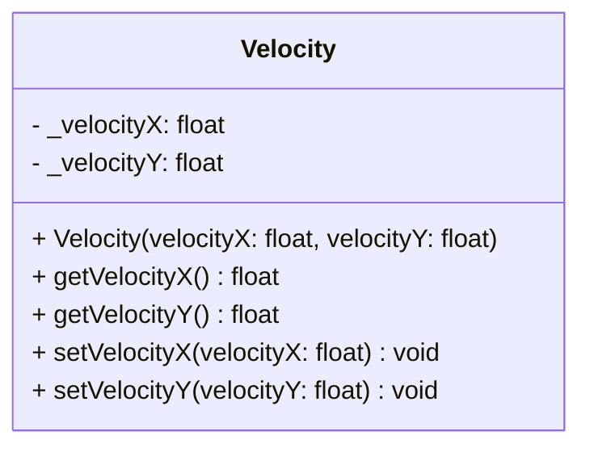

## Velocity

The **Velocity** component defines the movement speed and direction of an entity in 2D space.  
It holds values for both the X (horizontal) and Y (vertical) axes, representing units per second.

### Dependencies & Integration

This component is the primary driver for automated movement.

| Type | Name | Description |
|:---|:---|:---|
| **System** | [`Movement`](../systems/Movement.md) | The **Movement** system reads the **Velocity**, multiplies it by the delta time (`dt`), and adds the result to the [`Position`](Position.md) component. |
| **Linked Component** | [`Position`](Position.md) | The component that gets updated by the velocity vector. |

---

### Public Methods

| Method | Signature | Description |
|:------|:----------|:------------|
| **Get Velocity X** | `float getVelocityX() const;` | Returns the velocity value on the X axis. |
| **Get Velocity Y** | `float getVelocityY() const;` | Returns the velocity value on the Y axis. |
| **Set Velocity X** | `void setVelocityX(float velocityX);` | Updates the velocity on the X axis. |
| **Set Velocity Y** | `void setVelocityY(float velocityY);` | Updates the velocity on the Y axis. |

---

### Constructor

| Constructor | Signature | Description |
|:------------|:----------|:------------|
| **Velocity** | `Velocity(float velocityX, float velocityY);` | Initializes the component with specific speed values for X and Y axes. |

---

### Internal Data

