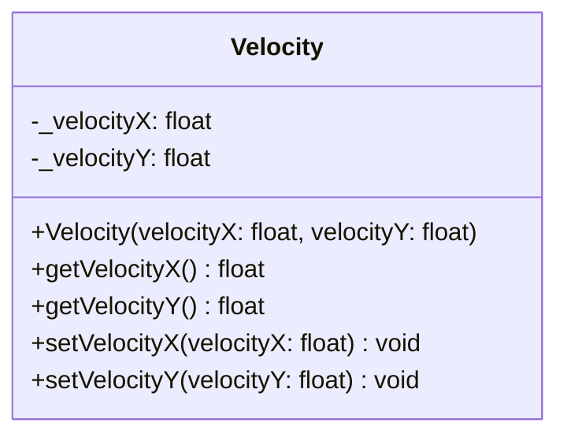

## Velocity

The Velocity component defines the movement speed and direction of an entity in 2D space. It holds values for both the X (horizontal) and Y (vertical) axes.

| Method | Signature | Description |
|:---|:---|:---|
| **Constructor** | `Velocity(float velocityX, float velocityY)` | Initializes the component with specific speed values for X and Y axes. |
| **Get Velocity X** | `float getVelocityX() const` | Returns the velocity value on the X axis. |
| **Get Velocity Y** | `float getVelocityY() const` | Returns the velocity value on the Y axis. |
| **Set Velocity X** | `void setVelocityX(float velocityX)` | Updates the velocity on the X axis. |
| **Set Velocity Y** | `void setVelocityY(float velocityY)` | Updates the velocity on the Y axis. |

