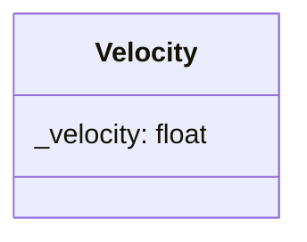

## Velocity

The Velocity component contains the

| Method           | Signature                          | Description                         |
|:-----------------|:-----------------------------------|:------------------------------------|
| **Get Velocity** | `float getVelocity() const`        | Returns the velocity of the entity. |
| **Set Velocity** | `void setVelocity(float velocity)` | Update the current velocity.          

