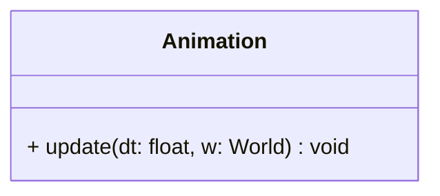

## Animation

The **Animation** system handles the logic for sprite-sheet animations.  
It iterates over all entities possessing an `Animator` component and updates their `Sprite` texture rectangle based on the elapsed time, effectively creating motion.

### Dependencies & Integration

This system acts as the bridge between logic time and visual representation.

| Type | Name | Description |
|:---|:---|:---|
| **Component** | [`Animator`](../component/Animator.md) | Holds the state (current frame, timer, frame rate) and logic to calculate the texture rectangle. |
| **Component** | [`Sprite`](../component/Sprite.md) | The target visual component whose `TextureRect` is updated to show the specific frame. |
| **Component** | [`Scene`](../component/Scene.md) | Used to filter entities; animations are only updated if the entity belongs to the active scene. |

---

### Public Methods

| Method | Signature | Description |
|:------|:----------|:------------|
| **Update** | `void update(const float& dt, World &w) override;` | Increases the animation timer by `dt`. If the timer exceeds the frame rate, it switches to the next frame and updates the sprite's texture area. |

---

