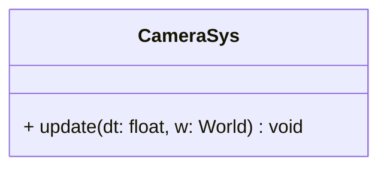

## CameraSys

The **CameraSys** system is responsible for camera tracking and viewport management.  
It synchronizes the logical `Camera` component with the entity's `Position`, ensuring the game view follows the camera entity (e.g., following the player or a scrolling path). Finally, it applies the view to the SFML window.

### Dependencies & Integration

This system connects spatial coordinates to the rendering engine's viewport.

| Type | Name | Description |
|:---|:---|:---|
| **Component** | [`Camera`](../component/Camera.md) | The component holding the `sf::View` configuration (zoom, size, viewport). |
| **Component** | [`Position`](../component/Position.md) | Used as the source coordinates to center the camera. |
| **Context** | `World` | Accesses the `sf::RenderWindow` to apply the active view (`setView`). |

---

### Public Methods

| Method | Signature | Description |
|:------|:----------|:------------|
| **Update** | `void update(const float& dt, World &w) override;` | Synchronizes the camera's center with the entity's position and sets the window's view. Note: `dt` is currently unused (instant tracking). |

