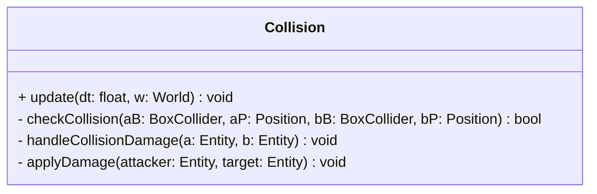

## Collision

The **Collision** system manages the physics interactions within the game world.  
It detects overlaps between entities using Axis-Aligned Bounding Boxes (AABB) and resolves gameplay events, such as dealing damage when a bullet hits an enemy or a player collides with a monster.

### Dependencies & Integration

This system acts as the physics engine and logic resolver.

| Type | Name | Description |
|:---|:---|:---|
| **Component** | [`BoxCollider`](../component/BoxCollider.md) | Defines the width, height, and offset of the physical area. |
| **Component** | [`Position`](../component/Position.md) | Defines the absolute coordinates of the entity in the world. |
| **Component** | [`Tag`](../component/Tag.md) | Used to identify the *type* of entity (e.g., "player", "enemy") to determine if a collision should result in damage. |
| **Component** | [`HP`](../component/Hp.md) / [`Damage`](../component/Damage.md) | Used to apply gameplay consequences (reducing health) upon collision. |

---

### Public Methods

| Method | Signature | Description |
|:------|:----------|:------------|
| **Update** | `void update(const float& dt, World &w) override;` | Iterates through all entities with colliders, checks for overlaps, and triggers interaction logic. |

### Internal / Helper Methods

| Method | Signature | Description |
|:------|:----------|:------------|
| **Check Overlap** | `bool checkCollision(const BoxCollider &aB, const Position &aP, const BoxCollider &bB, const Position &bP);` | Performs the AABB math to determine if two rectangles overlap. Returns `true` on collision. |
| **Resolve Logic** | `void handleCollisionDamage(const std::shared_ptr<Entity> &a, const std::shared_ptr<Entity> &b);` | Checks the **Tags** of colliding entities to decide interaction rules (e.g., Players take damage from Enemies). |
| **Apply Damage** | `void applyDamage(const std::shared_ptr<Entity> &attacker, const std::shared_ptr<Entity> &target);` | Retrieves `Damage` from the attacker and reduces `HP` of the target. |

---

