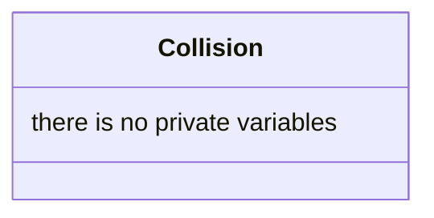

## Collision

The Collision detect if two entities enter in collision.

| Method | Signature | Description                                        |
| :--- | :--- |:---------------------------------------------------|
| **Update** | `void update(const float& dt, World &w)` | Update and tell if two entities enter in collision |
|**Check** | `bool Collision::checkCollision(const BoxCollider &aB, const Position &aP, const BoxCollider &bB, const Position &bP)` | Method used to check if two entities enter in collision |       

