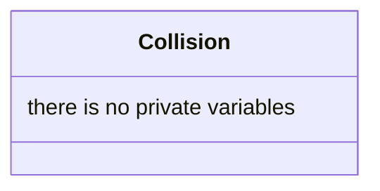

## Collision

The Collision system detects if two entities enter in collision and handles damage application based on entity tags.

| Method | Signature | Description |
| :--- | :--- |:--- |
| **update** | `void update(const float& dt, World &w)` | Updates collision detection and applies damage between colliding entities |
| **checkCollision** | `bool checkCollision(const BoxCollider &aB, const Position &aP, const BoxCollider &bB, const Position &bP)` | Static method to check if two entities' bounding boxes overlap |
| **handleCollisionDamage** | `void handleCollisionDamage(const std::shared_ptr<Entity> &a, const std::shared_ptr<Entity> &b)` | Handles damage application based on entity tags (player, enemy, bullets) |
| **applyDamage** | `void applyDamage(const std::shared_ptr<Entity> &attacker, const std::shared_ptr<Entity> &target)` | Applies damage from attacker to target if both have required components |

