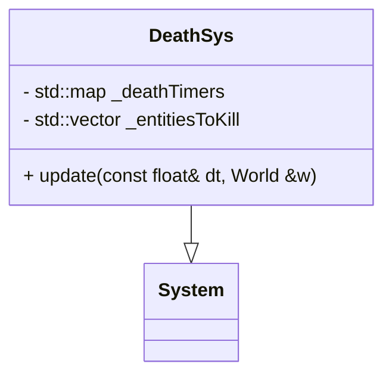

## DeathSys

The DeathSys system manages entity death logic by handling delayed destruction.  
It tracks entities with death timers and removes them from the world once their timer expires.

This system is typically used to:
- Delay entity removal (death animation, explosion, etc.)
- Ensure clean entity destruction after a defined time

---

### Public Interface

| Method | Signature | Description |
| :--- | :--- | :--- |
| **update** | `void update(const float& dt, World &w)` | Updates death timers and removes entities whose death delay has expired |

---

### Internal Data

| Member | Type | Description |
| :--- | :--- | :--- |
| `_deathTimers` | `std::map<uint64_t, float>` | Stores remaining death time for entities indexed by their ID |
| `_entitiesToKill` | `std::vector<uint64_t>` | Temporarily stores entities scheduled for removal |

---

### Behavior

- Each frame, the system:
    - Decreases death timers using `dt`
    - Identifies entities whose timer reached zero
    - Marks them for deletion
- Entities are removed from the `World` after processing to avoid iterator invalidation

---

### Usage Context

- Used in an **ECS architecture**
- Works alongside systems such as:
    - Health (HP reaches 0)
    - Animation / Explosion systems
- Ensures safe and deferred entity destruction

---

