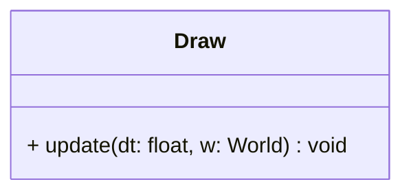

## Draw

The **Draw** system is the rendering engine of the ECS.  
It is responsible for displaying all visual entities on the screen. It handles filtering (based on the current scene), sorting (based on layers), and spatial transformations (position, rotation, scale) before drawing the final object.

It supports three types of visual components: **Sprites**, **Text**, and **RectangleShapes**.

### Dependencies & Integration

This system requires specific components to function and interacts with the SFML Window.

| Type | Name | Description |
|:---|:---|:---|
| **Visual Component** | [`Sprite`](../component/Sprite.md) | Renders a texture/image. |
| **Visual Component** | [`Text`](../component/Text.md) | Renders a string of characters. |
| **Visual Component** | [`RectangleShape`](../component/RectangleShape.md) | Renders a geometric shape. |
| **Data Component** | [`Layer`](../component/Layer.md) | Used to sort entities. Lower IDs are drawn first. |
| **Data Component** | [`Scene`](../component/Scene.md) | Used to filter entities. Only entities matching the World's current scene are drawn. |
| **Transform Component** | [`Position`](../component/Position.md) / [`Rotation`](../component/Rotation.md) / [`Scale`](../component/Scale.md) | Applied to the visual object to place it correctly in the world. |

---

### Public Methods

| Method | Signature | Description |
|:------|:----------|:------------|
| **Update** | `void update(const float& dt, World &w) override;` | Filters entities by Scene, sorts them by Layer, applies transformations, and draws them to the window. |

---

