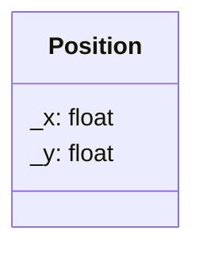

## Draw

The Draw system is one of the fundamental data structures in our ECS. It display the sprite of 

| Method | Signature | Description |
| :--- | :--- | :--- |
| **Update** | `void update(const float& dt, World &w)` | Display the sprite of the entity in the World `w` |

