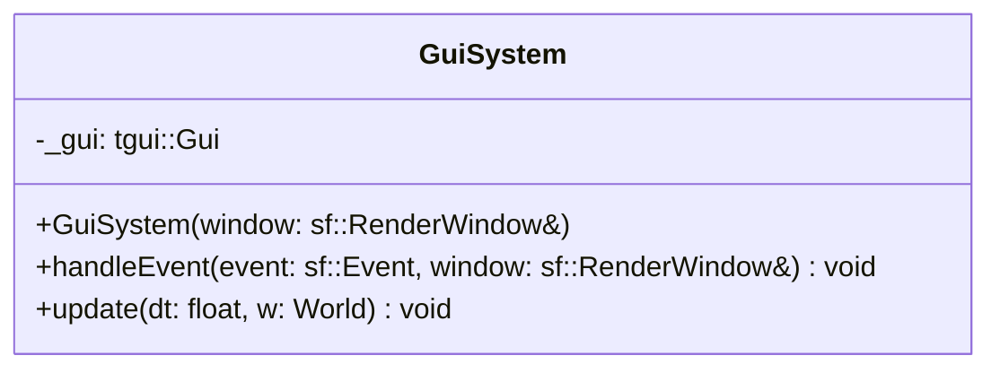

## GuiSystem

The **GuiSystem** is the bridge between the ECS architecture and the **TGUI** library. It manages the lifecycle, hierarchy, positioning, and rendering of all UI elements. It ensures that UI components are synchronized with game states (like Scenes) and visual priorities (Layers).

### Dependencies & Integration

This system orchestrates multiple components to provide a cohesive UI experience.

| Type | Name | Description |
|:---|:---|:---|
| **Component** | [`GuiWidget`](../component/GuiWidget.md) | The primary data source containing the actual TGUI widget and hierarchy info. |
| **Component** | [`Scene`](../component/Scene.md) | Used to filter which UI elements are interactive and visible based on the current world state. |
| **Component** | [`Layer`](../component/Layer.md) | Determines the Z-order; the system sorts entities to ensure correct overlapping. |
| **Component** | [`Position`](../component/Position.md) | (Optional) Used to drive the widget's coordinates from the ECS side. |
| **Helper** | [`GameHelper`](../../Game/GameHelper.md) | Used to resolve parent-child relationships via entity IDs. |

---

### Public Methods

| Method | Signature | Description |
|:------|:----------|:------------|
| **Handle Event** | `void handleEvent(const sf::Event& event, sf::RenderWindow& window);` | Processes raw SFML events. Temporarily resets the window view to `DefaultView` to ensure perfect mouse-to-widget coordinate mapping. |
| **Update** | `void update(const float& dt, World& w) override;` | The main logic loop: handles widget attachment, scene filtering, layer sorting, position syncing, and final rendering. |

---

### Internal Logic

#### 1. Hierarchical Attachment
When a `GuiWidget` is first processed:
*   If `parentId` is 0, the widget is added to the root `tgui::Gui` container.
*   If `parentId` is valid, the system searches for the parent entity. If the parent also has a `GuiWidget` that acts as a container (Panel, Layout, etc.), the child is attached to it.

#### 2. Scene Filtering & Visibility
The system compares the entity's `Scene` component with the `World::getCurrentScene()`. 
*   **Match**: The widget is set to visible and enabled.
*   **Mismatch**: The widget is hidden and disabled to prevent "ghost clicks" from background scenes.

#### 3. Z-Sorting (Layers)
Visible entities are collected into a temporary vector and sorted by their `Layer` value (ascending). The system then iterates through the sorted list and calls `moveToFront()` on each widget. This ensures that a widget with Layer 1000 appears on top of a widget with Layer 0.

#### 4. Coordinate Correction
To prevent the UI from "floating" or becoming offset when the game camera (`sf::View`) moves:
1.  The system saves the current game view.
2.  It applies the `DefaultView` (screen space).
3.  It calls `_gui.draw()`.
4.  It restores the original game view for other systems (like `Draw`).

---

### Internal Data

