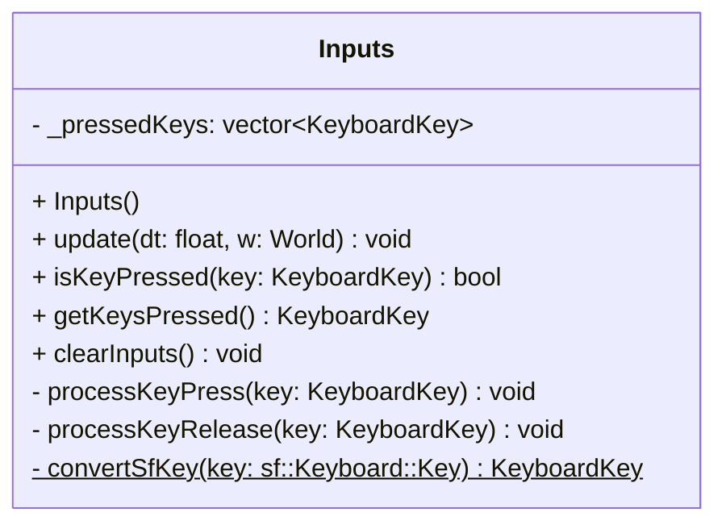

## Inputs

The **Inputs** system is responsible for capturing and managing the state of the keyboard.  
It intercepts SFML window events from the World and maintains a list of currently pressed keys using a custom `KeyboardKey` enum, abstracting the underlying library.

### Dependencies & Integration

This system acts as the bridge between the user hardware and the game logic.

| Type | Name | Description |
|:---|:---|:---|
| **Context** | [`World`](../World.md) | The system retrieves raw events to update its internal state. |
| **User** | *Game Logic* | Other systems query this system to check if specific keys are pressed. |

---

### Public Methods

| Method | Signature | Description |
|:------|:----------|:------------|
| **Update** | `void update(const float& dt, World &w) override;` | Polls events from the World. If a KeyPress or KeyRelease event is found, it updates the internal list of pressed keys. |
| **Is Key Pressed** | `bool isKeyPressed(KeyboardKey key) const;` | Checks if a specific key is currently held down. Returns `true` if pressed. |
| **Get Active Key** | `KeyboardKey getKeysPressed() const;` | Returns one of the currently pressed keys (useful for single-key detection). |
| **Clear Inputs** | `void clearInputs();` | Clears the list of pressed keys (useful when losing window focus). |

---

### Constructor

| Constructor | Signature | Description |
|:------------|:----------|:------------|
| **Inputs** | `Inputs();` | Initializes the input system and reserves memory for key storage. |

---

### Internal Data

