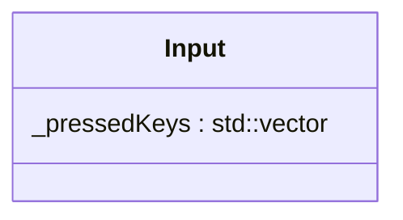

## Input

The Input system is one of the fundamental data structures in our ECS. It catch all key on keyboard.

| Method | Signature | Description |
| :--- | :--- | :--- |
| **Update** | `void update(sf::Event &event, class World &w);` | Update the Key with the event  |
| **Is Key Pressed** | ` bool isKeyPressed(KeyboardKey key) const;` | Return true is pressed or false otherwise.  |
| **Clear Inputs** | `void clearInputs();` | clear all the data stored in keyboard. |

