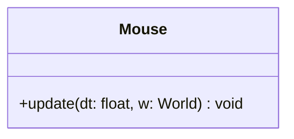

## Mouse

The **Mouse** system handles user interactions with UI elements.  
It tracks the mouse cursor's position relative to the game window, detects collisions with interactive entities (like Buttons), and manages their states (Idle, Hover, Pressed) and callbacks.

### Dependencies & Integration

This system transforms raw mouse inputs into high-level UI events.

| Type | Name | Description |
|:---|:---|:---|
| **Component** | [`Button`](../component/Button.md) | The target component containing state logic, callbacks, and visual settings. |
| **Component** | [`Position`](../component/Position.md) | Used to define the top-left corner of the interactive area. |
| **Component** | [`Sprite`](../component/Sprite.md) | Required to visually reflect the state change (tint color or texture rect change). |
| **Component** | [`Scene`](../component/Scene.md) | Used to ensure interactions only happen with buttons in the active scene. |

---

### Public Methods

| Method | Signature | Description |
|:------|:----------|:------------|
| **Update** | `void update(const float& dt, World &w) override;` | Calculates mouse coordinates, checks for overlaps with buttons, updates their states, executes callbacks, and modifies their visual appearance. |

---

